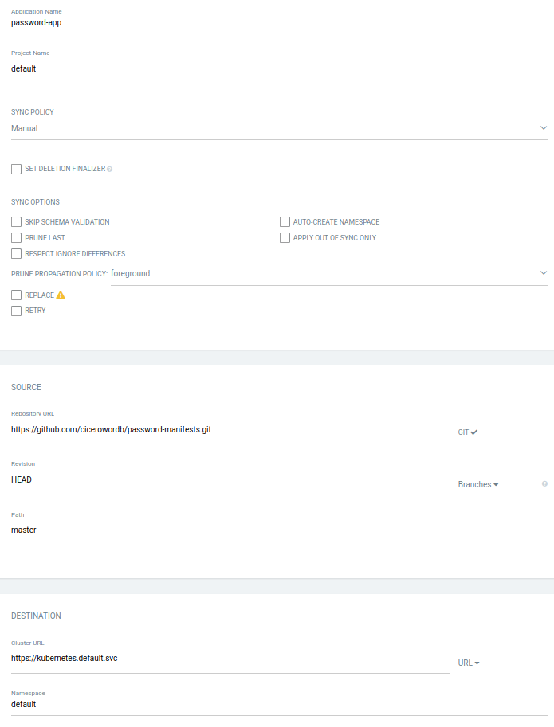
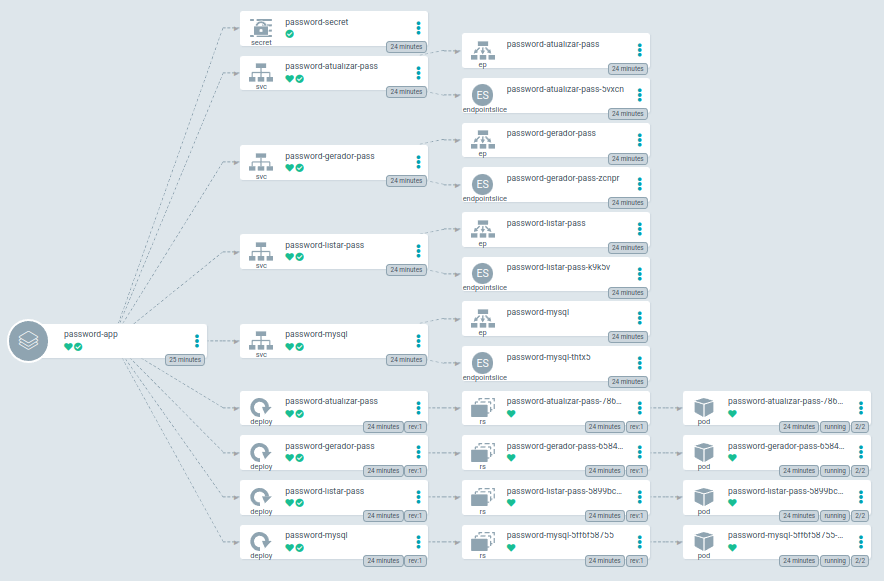

# Deploy on Kubernetes
To deploy aplication in a Kubernetes cluster we recommend to use ArgoCD.

Before start, you must to include a secret with Docker Registry credentials.
This secret can be generated as showed by 
[Sergey Kryvets in his blog](https://skryvets.com/blog/2021/03/15/kubernetes-pull-image-from-private-ecr-registry/). 
This secrets is configured in all deployments in the option **imagePullSecrets**.

Create a new ArgoCD App and point to master folder inside git repository. 
This image shows configuration needed.

After correct instalation ArgoCD will show this diagram>

